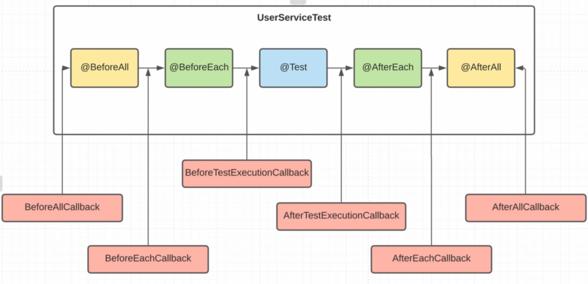

# Extension Model Теория

В JUnit4 была аннотация @RunWith с помощью которой мы могли задавть свой раннер. Это нужно было, 
чтобы заинжектить нужные зависимости.
В JUnit5 этой аннотации нет
Зато появилась @ExtendWith
Обычно ипользуются готовые, но для понимания мы рассмотрим все варианты на примере создания 
своих экзхемпляров.
ExtendWith имеет несколько вариантов использования:
1. Test life cicle callbacks
   callback - это всего лишь интерфейсы реализовав который мы можем внедриться на любой из 
   этапов жизненгого цикла тестов, см. рис где мы видим 6 разных callbacks каждый из которох 
   может внедриться на свой этап, перед ними
   
   

Создадим класс GlobalExtention в котором реализуем нужные нам callbacks
После чего доабвим этот класс в ExtendWith
Мы так же можем добавить несколько классов
```
@ExtendWith({GlobalExtentionOne.class,
GlobalExtention.class})
```
Мы можем создать abstract class TestBase, втором добавим эту аннотацию
а затем наследоваться от него, там где она нужна и уже нам не надо будет добавлять ее
```class UserServiceTest extends TestBase {```

2. PostProcessing instans
Создадим класс PostProcessingExtention

3. Conditionl test excution


4. Extension Handling
Это кодга мы обрабатываем Exeption которые появляются в наших тестовых методах
Создадим класс TrowableExtension
И добавим в метод trowExeptionIfUsernameOrPasswordIsNull Exeption: IOException


