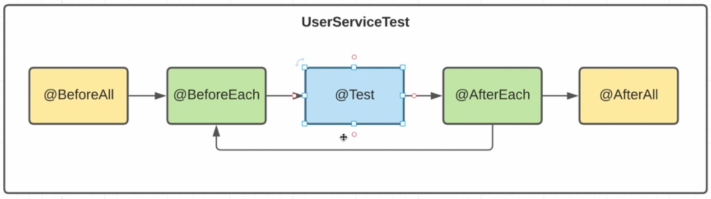

# 03 - созадем первые тесты

# 04 Рассмотрим жизненный цикл тестов



@BeforeEach - код выполняемый перед каждым тестом
@AfterEach - код выполняемый после каждого теста
@BeforeAll - код выполняемый перед всеми тестатми, один раз
@AfterAll - код выполняемый после всех тестов, один раз

Добавим их в наш код
BeforeAll и AfterAll это статические методы, для начала нам андо определить тип эизненгго цикла
```aidl
@TestInstance(TestInstance.Lifecycle.PER_METHOD)
```
Но если мы зададим настройки
```aidl
@TestInstance(TestInstance.Lifecycle.PER_CLASS)
```
Что означает, что объект будет создан в единственном экземпляре, то нам не нужно обявлять эти 
методы как статические, т.к. они так будут созданы в единственном экземпляре
