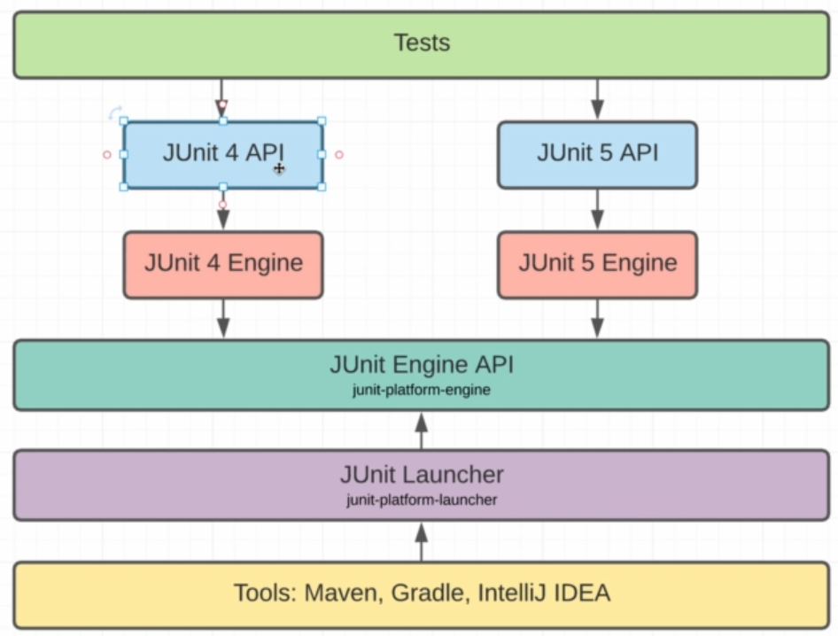

# Рассмотрим жизненный цикл тестов


@BeforeEach - код выполняемый перед каждым тестом
@AfterEach - код выполняемый после каждого теста
@BeforeAll - код выполняемый перед всеми тестатми, один раз
@AfterAll - код выполняемый после всех тестов, один раз

Добавим их в наш код
BeforeAll и AfterAll это статические методы, для начала нам андо определить тип эизненгго цикла
```aidl
@TestInstance(TestInstance.Lifecycle.PER_METHOD)
```
Но если мы зададим настройки
```aidl
@TestInstance(TestInstance.Lifecycle.PER_CLASS)
```
Что означает, что объект будет создан в единственном экземпляре, то нам не нужно обявлять эти 
методы как статические, т.к. они так будут созданы в единственном экземпляре

Разберемся как мы можем запускать тесты

Рассмотирм как устроена схема


На схеме мы видим, что IDEA (Maven) используют junit-platform-launcher
Подключим эту зависимость в проекте
Создадим класс TestLauncher
Запустим метод main нашего класса на выполнение и увидим отчет по нашим тестам

Вот таким образом можно запустаить тесты самостоятельно. Именно так их и запускает наша IDE.


# Сторонние библиотеки

Есть более удобные билиотеке для assert
## asserj - вроде как самая удобная
подключим ее

## hamcrest
подключим ее

# Исключения
Проверим, что метод пробрасывает исключение
Создадим метод trowExeptionIfUsernameOrPasswordIsNull в котором проверим, что наш метод 
пробрасывает исключения в случае пердачи нулевых значений
Но если мы хотим проверить еще и password , то нам придется написат ьеще один тест или блок, 
поэтому мы будем использоваоть другой подход используюя спец assert см метод trowsExeptionIfUsernameOrPasswordIsNull

Допустим нам необходимо проверить, что выпало именно наше исключение см. метод 

# Tag   
Методы можно помечать аннотацией Tag
Мы можем вызывать только методы помеченные тегами, например мы хотим запустить тесты с двумя тегами 
login  и user
```
mvn clean test -Dgroups=login,user
```
А если мы хотим исключить из тестов методы с этими тегами, то
```
mvn clean test -DexcludedGroups=login,user
```
Тэгами можно помечать и целы классы, см. тег fast

# Порядок запуска тестов

Тесты всегда запускаются в случайном порядке, но в JUnit5 появилась возможность задавать этот 
порядок
Ставим такую аннотацию на класс
```
@TestMethodOrder(MethodOrderer.OrderAnnotation.class)
```
И далее по методам расставляем такие аннотации
```
@Order(1)
@Order(2)
...
```
TestMethodOrder не рукомендуется использовать, т.к. это антипатерн
# @DisplayName
используйте эту аннотацию для отображения коментарием к методу во время выполнения тестов


