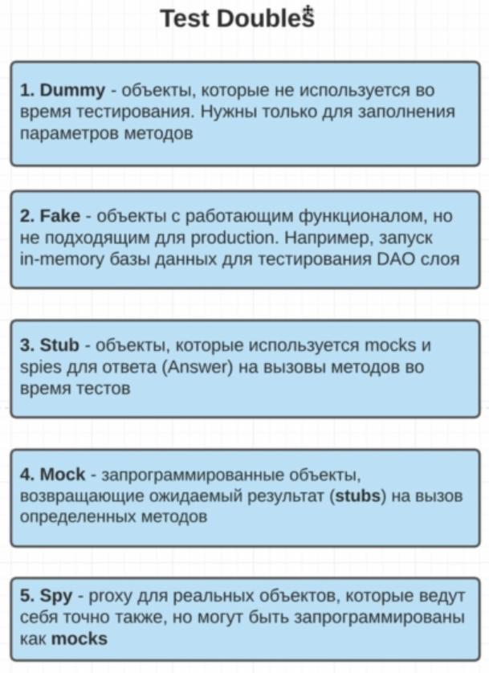

Чтобы подключить другой сервис, т.е. это будет уже интеграционный тест.
В этом нам поможет фреймвор Mockito,
Для этого используются дублеры doubles, и всего их пять видов:

1. Dummy - например мы передаем како-то параметр метода, которой не используем в тесте
2. Fake - для тестов мы поднимаем не реальную бд а H2
3. Stub - объект который должен вернуться, если мы у других Mock или spy вызваем с определенными 
   параметрами
4. Mock - возмращает ожидаемый результат (Stub) на вызов опрделенных методов
5. Spy - если мы что то меняем, то он превращается в mock, а если нет, то это реальный объект

Подлкючим библиотеку Mockito

## Mock
